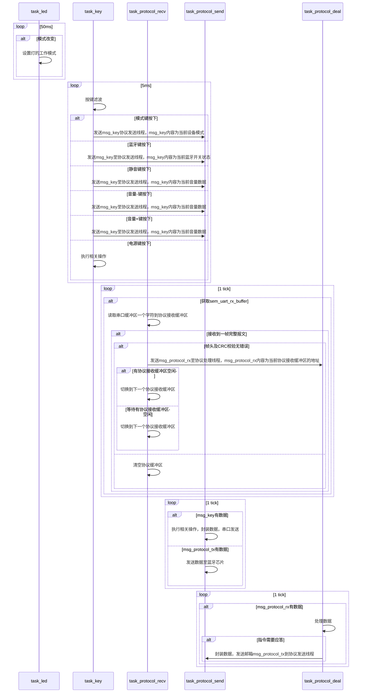

# lvgl790_stm32f103
lvgl790移植到stm32f103，显示使用FSMC驱动

```mermaid
%%设置模式需要用一个互斥量保护
%%音量设置需要一个互斥量保护
%%每一个协议缓冲区需要一个信号量进行同步
%%串口发送必须互斥
sequenceDiagram	
	participant led as task_led
	participant key as task_key
	participant recv as task_protocol_recv
	participant send as task_protocol_send
	participant deal as task_protocol_deal
	%%需要注意不同数据
	loop 50ms
		alt 模式改变
			led->>led:设置灯的工作模式
		end		
	end

	loop 5ms
		key->>key: 按键滤波
		alt 模式键按下
			key->>send:发送msg_key协议发送线程，msg_key内容为当前设备模式
		else 蓝牙键按下
			key->>send:发送msg_key至协议发送线程，msg_key内容为当前蓝牙开关状态
		else 静音键按下
			key->>send:发送msg_key至协议发送线程，msg_key内容为当前音量数据
		else 音量-键按下
			key->>send:发送msg_key至协议发送线程，msg_key内容为当前音量数据
		else 音量+键按下
			key->>send:发送msg_key至协议发送线程，msg_key内容为当前音量数据
		else 电源键按下
			key->>key:执行相关操作
		end
	end

	loop 1 tick
		alt 获取sem_uart_rx_buffer
			recv->>recv:读取串口缓冲区一个字符到协议接收缓冲区
			alt 接收到一帧完整报文
				alt 帧头及CRC校验无错误
					recv->>deal:发送msg_protocol_rx至协议处理线程，msg_protocol_rx内容为当前协议接收缓冲区的地址
					alt	有协议接收缓冲区空闲
						recv->>recv:切换到下一个协议接收缓冲区
					else 等待有协议接收缓冲区空闲
						recv->>recv:切换到下一个协议接收缓冲区
					end
				else
					recv->>recv:清空协议缓冲区
				end
			end
		end
	end
	
	loop 1 tick
		alt msg_key有数据
			send->>send:执行相关操作，封装数据，串口发送
		else msg_protocol_tx有数据
			send->>send:发送数据至蓝牙芯片
		end
	end

	loop 1 tick	
		alt msg_protocol_rx有数据
			deal->>deal:处理数据
			alt 指令需要应答
				deal->>send:封装数据，发送邮箱msg_protocol_tx到协议发送线程
			end
		end
	end
```
